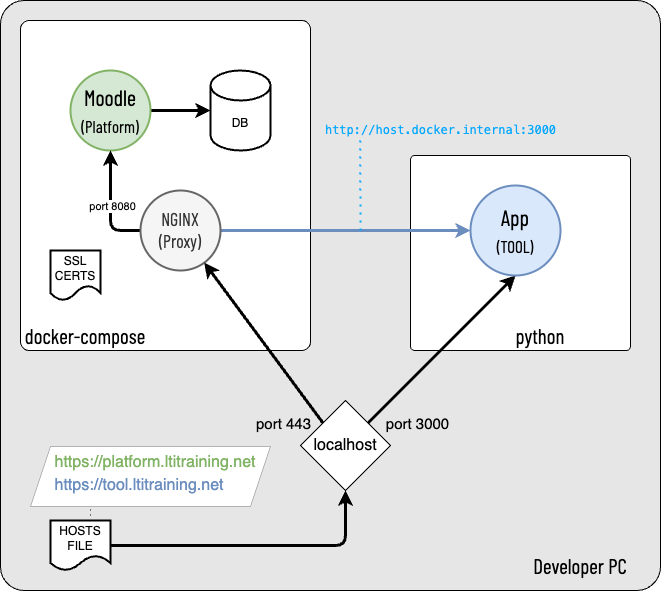

# **LTI Bootcamp  (Python)**

Welcome to the LTI Bootcamp (Python Edition)! 

This repository provides all the necessary files and activities to help you set up a working LTI environment using Docker, Python, and Node.js.

## **Overview**


In this workshop, we will:
- Set up a Docker-based environment to run Moodle with LTI support.
- Configure and run an LTI 1.3 tool.
- Work through hands-on activities to understand how to develop and test LTI applications.

## **Prerequisites**

Before starting the workshop, please ensure you have the following installed:
- **Docker Desktop** ([Download here](https://www.docker.com/products/docker-desktop))
- **Python 3** ([Download here](https://www.python.org/downloads/))
- **Pipenv** (for Python environment management)
- **A code editor** (We recommend [VS Code](https://code.visualstudio.com/))

You will also need **administrator access** to update your machine's `hosts` file to map the domains `platform.ltitraining.net` and `tool.ltitraining.net` to your local development environment.
### Optional
The code in this workshop uses TailwindCSS.  If you wish to modify the visual aspects of the projects you may need ;

- **TailwindCSS CLI** (for CSS framework utility)
- **Node.js** (for running JavaScript-based tools, such as `npx`)


For detailed installation instructions, please see [Activity 0: Installing Prerequisites](./docs/activity0.md).

---

## **Workshop Activities**

Below is a list of activities that you will complete during the workshop. Each activity has a detailed guide to follow.

1. **[Activity 0: Installing Prerequisites](./docs/activity0.md)**  
   Get started by installing all the necessary tools and software for the workshop.

2. **[Activity 1: Setting Up the Git Repository and Docker Environment](./docs/activity1.md)**  
   Learn how to clone the repository and set up your Docker environment for running Moodle and the LTI tool.

3. **Activity 2: Configuring Moodle with LTI Tool** *(Coming Soon)*  
   This activity will guide you through configuring Moodle as the LTI platform and setting up the tool for testing.

4. **Activity 3: Exploring LTI 1.3 Tool Development** *(Coming Soon)*  
   Dive into the development process of an LTI 1.3 tool and test it with your Moodle platform.


## **Getting Started**

1. Clone this repository to your local machine:
   ```bash
   git clone https://github.com/1EdTech/LTI-bootcamp-python.git
   ```

2. Follow **[Activity 0](./docs/activity0.md)** to install the necessary prerequisites. 

3. Once all prerequisites are installed, follow **[Activity 1](./docs/activity1.md)** to set up your Docker environment and get Moodle running.

4. Some of the common commands you may need to start, stop and clean up your development environments are detailed in [Common Tasks](docs/common_tasks.md).

---

## **Need Help?**

If you encounter any issues during the workshop, please reach out to the instructor or refer to the troubleshooting section at the end of each activity.
