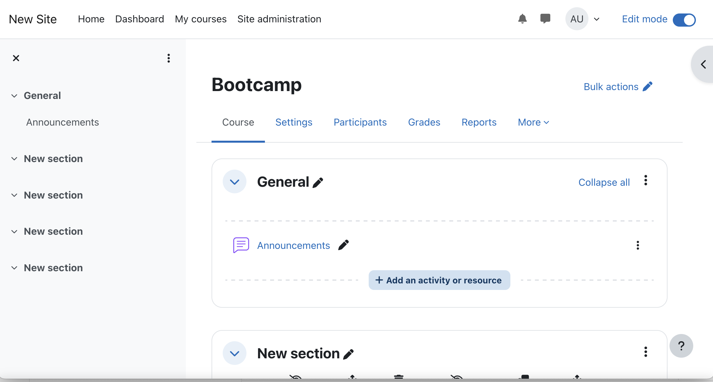

# Workshop Activity 2: Configuring Moodle to Launch Your Tool

### Objective:
By the end of this activity, you will have a fully configured Learning Management System (Moodle) ready for developing and testing your tool.

### Prerequisites:
Please ensure you have completed:
- Activity 1
- Checklist

---

### **Steps to Follow:**

#### 1. **Log in to Moodle**

Access Moodle at `https://platform.ltitraining.net`. Use the following default login credentials:

- **Username**: user  
- **Password**: _B00tcamp

Feel free to change your password in your user profile if needed.

#### 2. **Configure Moodle HTTP Security**

By default, Moodle blocks HTTP calls to local IP addresses. While this is important in production environments, it can disrupt connectivity in a local Docker setup. Here’s how to adjust this setting:

1. Navigate to **Site Administration** ➡️ **General** ➡️ **Security** ➡️ **HTTP Security** or use this direct link: [HTTP Security](https://platform.ltitraining.net/admin/settings.php?section=httpsecurity).
2. Locate the **cURL blocked hosts list** field and clear any listed addresses.
3. Press **Save changes**.

#### 3. **Upload Users**

To test your tool with multiple users, you’ll need to upload a list of sample users:

1. Navigate to **Site Administration** ➡️ **Users [tab]** ➡️ **Accounts** ➡️ **Upload Users** or use this direct link: [Upload Users](https://platform.ltitraining.net/admin/tool/uploaduser/index.php).
2. Upload the sample user list from `./environment/data/accounts.csv`.
3. Moodle will display a preview of the records. In the **New user password** field, select **Field required in file**.
4. Confirm the upload by pressing the **Upload Users** button.

You can now log in to Moodle using any of the test student or instructor accounts. The format for the accounts is as follows:

- **Students**:  
  Username: `s[1-10]@example.com`  
  Password: _B00tcamp

- **Instructors**:  
  Username: `i[1-5]@example.com`  
  Password: _B00tcamp

#### 4. **Create a Course**

To proceed with testing, you’ll need to create a course:

1. In the top navigation bar, click on **My Courses** or use this direct link: [My Courses](https://platform.ltitraining.net/my/courses.php).
2. Click **Create Course**.
3. Fill out the following details:
   - **Course full name**: Bootcamp
   - **Course short name**: Bootcamp
   - **Course format**: Custom Sections
4. Accept the default settings for the remaining fields.
5. Click **Save and Display** to view the newly created empty course.

---

### **Activity Summary:**

Congratulations! You’ve successfully set up Moodle with:
1. A set of users (10 students and 5 instructors).
2. An empty course ready for content.
3. Updated HTTP Security settings to allow local tool development.

You’re now ready to start developing and launching your LTI tool within Moodle.
