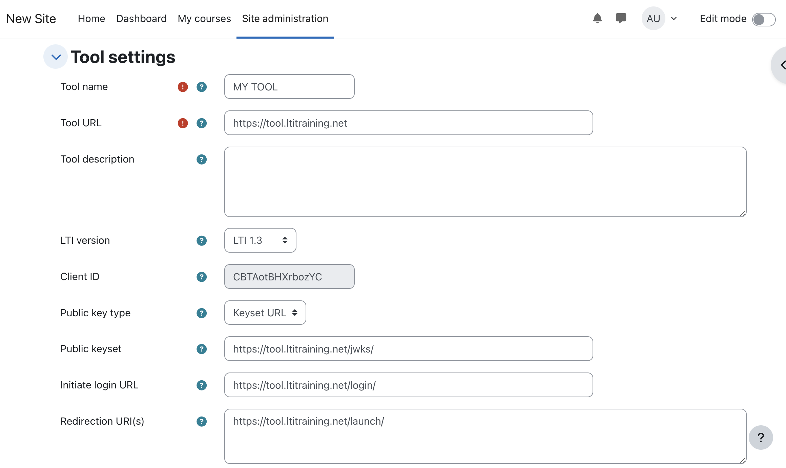
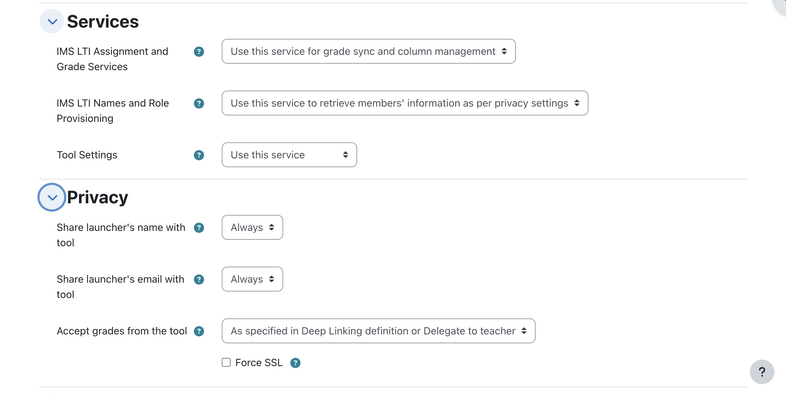
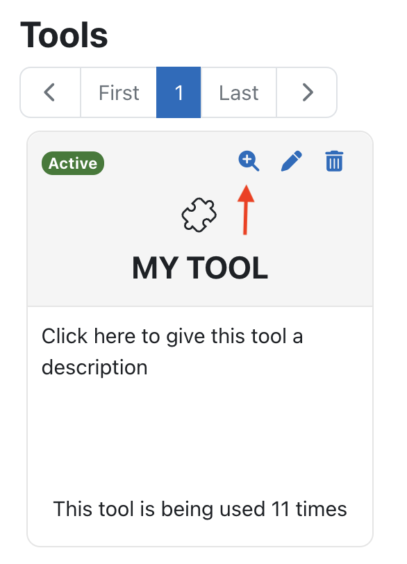
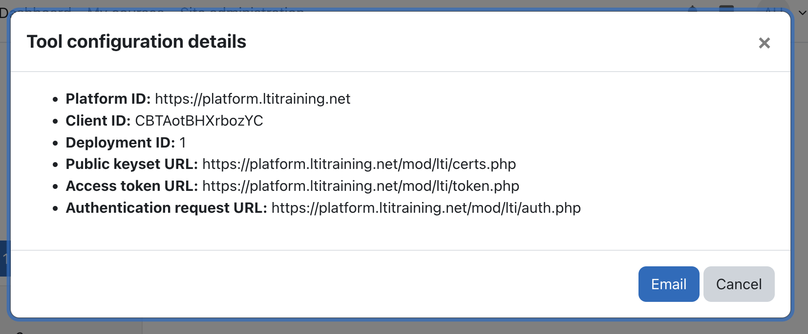
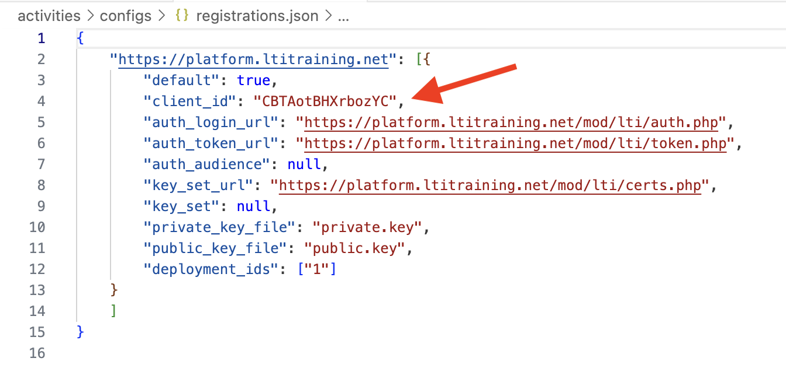

# Workshop Activity 3: Configuring the LTI Tool in Moodle

### Objective:
By the end of this activity, you will have successfully configured an LTI 1.3 tool in Moodle, enabling it to launch and interact with the course environment.

### Prerequisites:
Please ensure you have completed:
- Activity 2 (Configuring Moodle)

---

### **Steps to Follow:**

#### 1. **Access the External Tool Settings**

1. Navigate to **Site Administration** ➡️ **Plugins** ➡️ **Activity modules** ➡️ **External tool** or use this direct link: [External Tool Configuration](https://platform.ltitraining.net/mod/lti/toolconfigure.php).
2. Click on **Manage tools** at the top of the page.

#### 2. **Add a New LTI Tool**



1. Click **Configure a tool manually**.
2. Fill out the following details:

   - **Tool name**: Choose a name that reflects the purpose of your tool (e.g., "MY TOOL").
   - **Tool URL**: Enter the URL of your LTI 1.3 tool (e.g., `https://tool.ltitraining.net`).
   - **LTI version**: Select **LTI 1.3**.

3. In the **Public keyset URL** field, enter the JWKS URL of your tool. Example:  
   `https://tool.ltitraining.net/jwks/`.

4. Under **Initiate login URL**, enter the login initiation endpoint of your tool. Example:  
   `https://tool.ltitraining.net/login/`.

5. In the **Redirection URI(s)** field, provide the redirect URL used by your tool to handle successful launches. Example:  
   `https://tool.ltitraining.net/launch/`.

6. Set **Tool configuration usage** to 

    `Show in activity chooser and as a preconfigured tool`.

7. For **Default launch container**, choose 
    `Embed, without blocks` 
    
    (this ensures the tool launches within Moodle without external redirection).

#### 3. **Configure LTI Tool Capabilities**



1. Scroll down to the **Services** section.
2. Select **Use this service** for the following options:
   - **IMS LTI Assignment and Grade Services**
   - **IMS LTI Names and Role Provisioning Services**

These services allow your tool to manage grades and retrieve user roles from Moodle.

3. In the **Privacy** section, set the following:
   - **Share launcher's name with tool**: Always
   - **Share launcher's email with tool**: Always
   - **Accept grades from the tool**: As Specified in Deep Linking

4. Press `Save Changes`

#### 4. **Configure the Tool with the Moodle Registration**

The Tool needs to know the LTI registration information.  



1. The list of external tools in Moodle should now include the registered tool you created in the previous step.



2. Find the `magnifier plus` icon to reveal the Platform information that a LTI tool requires.
3. Copy the **Client Id**
4. Paste the **Client Id** in the tools registrations file

```
./activities/configs/registrations.json
```




Most of this information is already populated on the example code.

#### 5. **Test the Tool Configuration**

1. Navigate to a course where you want to test the LTI tool (e.g., the "Bootcamp" course created in Activity 2).
2. From the course page, click **Turn editing on**.
3. In any section, click **Add an activity or resource** and select **External tool** from the list.
4. In the **Preconfigured tool** dropdown, select the LTI tool you just created.
5. Click **Save and display** to launch the tool.

If everything is set up correctly, your LTI tool should now launch within Moodle and be able to interact with the course environment.

---

### **Activity Summary:**

Well done! You have successfully:

1. Configured an LTI 1.3 tool in Moodle.
2. Enabled key LTI services such as Assignment and Grade Services, and Names and Roles.
3. Launched the tool from within a course.

You are now ready to test and develop your LTI tool in Moodle's environment.

