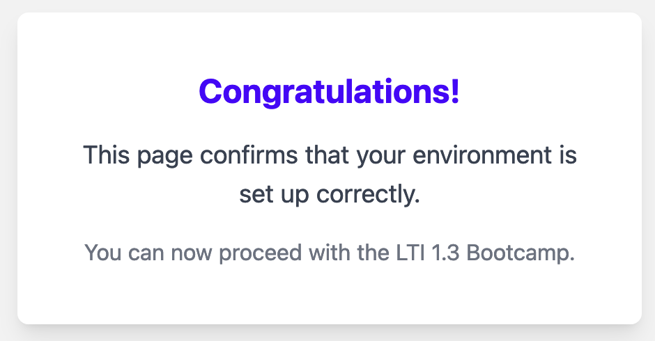

# **Quick Checklist for Workshop Setup**

After setting up your environment, run the following quick tests to ensure everything is working correctly. These tests will verify that everythng is running as expected.

---

## **1. Docker and Moodle Environment**

### **Test 1: Verify Docker Containers**

First, ensure that all the Docker containers (Moodle, MariaDB, Nginx) are running correctly.

1. In the terminal or PowerShell, navigate to the `environment/` directory.
2. Run the following command to check the status of the Docker containers:

```bash
docker-compose ps
```

You should see the status as `Up` for the Moodle, MariaDB, and Nginx containers. For example:

```bash
CONTAINER ID   IMAGE                  COMMAND                  CREATED       STATUS       PORTS             
a9e9b803832b   environment-tool       "/usr/src/app/entryp…"   5 hours ago   Up 5 hours   0.0.0.0:3000->...
ee39addd9116   nginx:alpine           "/docker-entrypoint.…"   7 hours ago   Up 7 hours   80/tcp, 0.0.0.0:443->...
f6f32f1edc97   bitnami/moodle:4.5.0   "/opt/bitnami/script…"   7 hours ago   Up 7 hours   0.0.0.0:8080->...
ec1c0138c758   bitnami/mariadb:10.6   "/opt/bitnami/script…"   7 hours ago   Up 7 hours   3306...
```

If the containers are not running, use `docker-compose up` to start them.

---
### **Test 2: Ping the domains

From a terminal console, test you should be able to ping the platform and tool environments;

```
ping tool.ltitraining.net
```

```
ping platform.ltitraining.net
```

You should see successful replies coming from both environments

---
### **Test 3: Access Test Flask Application**

1. Open your browser.
2. Navigate to the following URL:

```
https://tool.ltitraining.net
```



You should see a success message from the Flask Application page. If the page doesn’t load, double-check that the containers are running, and ensure that your `/etc/hosts` file is correctly configured to resolve `tool.ltitraining.net` to `127.0.0.1`.


---

### **Test 4: Access Moodle**

1. Open your browser.
2. Navigate to the following URL:

```
https://platform.ltitraining.net
```

You should see the Moodle login page. If the page doesn’t load, double-check that the containers are running, and ensure that your `/etc/hosts` file is correctly configured to resolve `platform.ltitraining.net` to `127.0.0.1`.


---


## **Summary of Quick Tests**:
- **Test 1**: Check Docker container status.
- **Test 3**: Ping the platform and tool environments
- **Test 3**: Access Test Application via `https://tool.ltitraining.net`.
- **Test 4**: Access Moodle via `https://platform.ltitraining.net`.

Running through these tests will ensure that everything is correctly set up and functioning for the workshop.